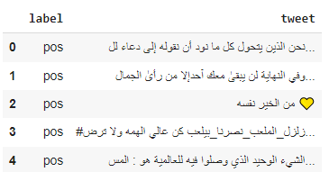
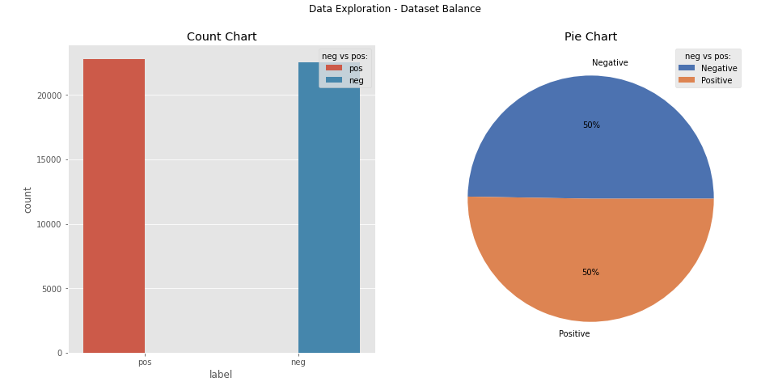
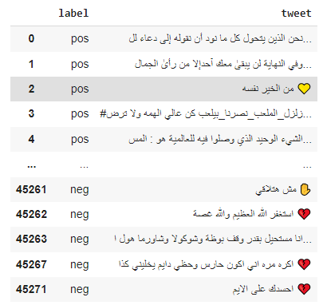
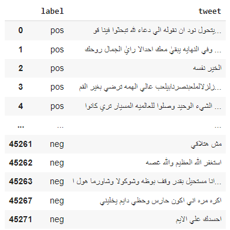
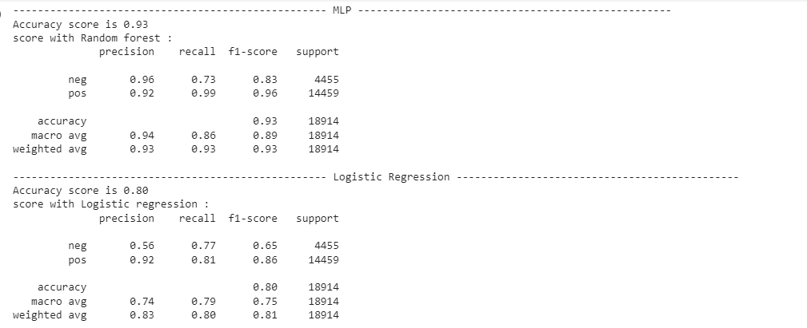
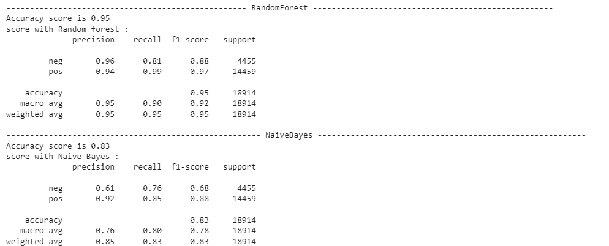
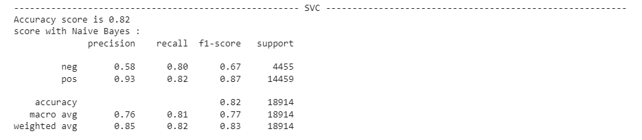
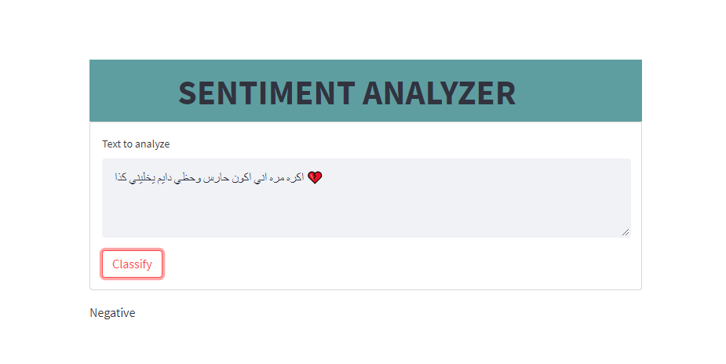

<h2>Brief introduction:</h2>

This web application developed using Streamlit to analyze and extract sentiments from Arabic tweets using
artificial intelligence and Deep Learning. I used CNN as a model to classify tweets (positive/negative).

<h2>Dataset Exploration:</h2>

<h2>Data Preprocessing:</h2>
<h3>Data before preprocessing:</h3>

<h3>Data after preprocessing:</h3>

<h2>Algorithms benchmarking:</h2>

<h2>Web App Snippet:</h2>

  
<h2>🧐 Features</h2>

Here're some of the project's best features:
*   Classify arabic tweets to either positive or negative
  
  
<h2>💻 Built with</h2>

Technologies used in the project:

*   Python
*   Streamlit
*   Scikit-learn
*   Keras
